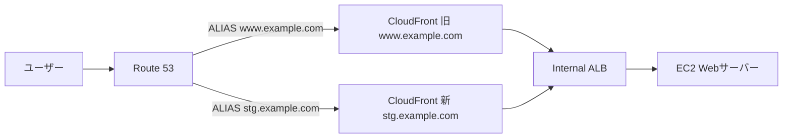

## はじめに

本番運用中のCloudFrontの設定を変更する際、ダウンタイムや切り戻しのリスクをどう扱うかについて迷いましたので、備忘録として検討した事項をまとめてみようというのが今回の記事の目的です。

CloudFront + ALB間の通信をHTTPSに移行した際に検討した2つのアプローチを比較・検証しました。今回はHTTPS化があくまで題材ですが、ここで紹介する考え方はキャッシュポリシーの変更やオリジンの切り替えなど、あらゆるCloudFrontの設定変更に応用できると思っています。

---

## 構成概要

- CloudFront：コンテンツ配信、SSL終端
- ALB：Internal ALB（VPC Origin経由でアクセス）
- ACM：ALB用の証明書を発行（リージョン：ap-northeast-1）

---

## 移行方法の検討

HTTPS移行にあたり、以下の2つの方法を検討しました。
前提として、本番影響リスクを抑えるため事前検証を行うことを必須としています。

### 方法A：DNS切り替え（Route 53 ALIASレコード変更）

新しいCloudFrontディストリビューションを作成し、検証用ドメインで動作確認後に本番ドメインのALIASレコードを切り替える方法です。

**手順**

1. ACMでALB用の証明書を発行（ap-northeast-1）
2. ALBにHTTPSリスナー（443）を追加し、発行した証明書を割り当て
3. 新しいCloudFrontディストリビューションを作成（代替ドメインに`stg.example.com`を設定）
4. Route 53に検証用ドメイン（`stg.example.com`）のALIASレコードを作成し新ディストリビューションに向ける
5. 検証用ドメインで動作確認
6. 問題なければ以下の順で本番ドメインを切り替え
    - 旧ディストリビューションの代替ドメインから`www.example.com`を削除
    - 新ディストリビューションの代替ドメインに`www.example.com`を追加
    - Route 53のALIASレコードを新ディストリビューションに変更
7. 切り戻す場合は以下の順で実施
    - 新ディストリビューションの代替ドメインから`www.example.com`を削除
    - 旧ディストリビューションの代替ドメインに`www.example.com`を追加
    - Route 53のALIASレコードを旧ディストリビューションに戻す

**特徴**

- 切り替え・切り戻しの操作手順が直感的にイメージしやすい
- 継続デプロイポリシーに比べて作業量が多い

#### DNSでの切り替えの致命的な欠点

DNS切り替えにおいてどうしてもダウンタイムが発生してしまう根本的な原因は、**CloudFrontが同一の代替ドメインを複数のディストリビューションに設定することを許可していない**点にあります。

ダウンタイムの発生タイミングを整理すると以下の通りです。

**切り替え時**

1. 旧ディストリビューションの代替ドメインから本番ドメインを削除
   　← **ここからダウンタイム発生**
2. 新ディストリビューションの代替ドメインに本番ドメインを追加（反映時間あり）
3. Route 53のALIASレコードを新ディストリビューションに変更
   　← **ここでダウンタイム解消**

**切り戻し時**

1. 新ディストリビューションの代替ドメインから本番ドメインを削除
   　← **ここから迅速な切り戻しが困難**
2. 旧ディストリビューションの代替ドメインに本番ドメインを追加（反映時間あり）
3. Route 53のALIASレコードを旧ディストリビューションに戻す

この制約がある限り、DNS切り替えでは切り替え時にダウンタイムが発生し、切り戻し時も迅速な対応が困難です。

※代替ドメインの付け替えの際に発生するダウンタイムについては、いくつか回避策がありますがそれについては後の項で触れます。

---

### 方法B：継続デプロイポリシー

CloudFrontの継続デプロイポリシーを使い、ステージングディストリビューションで事前検証してから本番に適用する方法です。

#### 継続デプロイポリシーとは

継続デプロイポリシーはCloudFrontが提供する機能で、本番ディストリビューションに紐づく**ステージングディストリビューション**を作成し、設定変更を安全に検証してから本番に適用できる仕組みです。

#### ステージングディストリビューションとは

本番ディストリビューションの設定をコピーして作成される検証用のディストリビューションです。独自のドメイン（`xxxxx.cloudfront.net`）を持ち、本番トラフィックに影響を与えずに設定変更を検証できます。

#### トラフィックの振り分け方法

ステージングディストリビューションへのトラフィックの振り分けは以下の2つの方法から選択できます。

| 方法 | 概要 | 用途 |
|------|------|------|
| **ヘッダーベース** | 特定のHTTPヘッダーを持つリクエストのみステージングに転送 | 開発者やテスターのみ検証したい場合 |
| **割合ベース** | 全トラフィックの指定した割合をステージングに転送 | 段階的なロールアウトをしたい場合 |

#### 本番への昇格（プロモート）

ステージングでの検証が完了したら、ステージングの設定を本番ディストリビューションに昇格（プロモート）させます。プロモートはAWSコンソールまたはCLIから実行でき、本番ディストリビューションの設定が即座に更新されます。

#### 切り戻し機能について

継続デプロイポリシーには**切り戻し機能はありません**。これはステージングで十分に検証してから本番適用することを前提とした設計のためです。万が一本番適用後に問題が発生した場合は、手動で設定を元に戻す必要があります。

そのため継続デプロイポリシーを使う際は以下の点が重要です：

- ステージングでの検証を十分に行う
- 本番適用前にロールバック手順を準備しておく
- 問題発生時に迅速に対応できる体制を整えておく

**手順**

1. ACMでALB用の証明書を発行（ap-northeast-1）
2. ALBにHTTPSリスナー（443）を追加
3. CloudFrontのステージングディストリビューションを作成
4. ステージングのオリジン設定をHTTPSに変更して動作確認
5. 問題なければ本番ディストリビューションに適用

**特徴**

- 手順がシンプル
- ステージングで事前検証できる
- 切り戻し機能はなく、事前検証で問題がないことが前提

---

## 実際に選んだ方法：継続デプロイポリシー

継続デプロイポリシーには切り戻し機能がありませんが、そもそも「ステージングで正常動作を確認してから本番適用する」という前提のため、切り戻しは考慮不要と判断しました。また手順のシンプルさからこちらを採用しました。

---

## 追加の検討

これまでの検討を踏まえて、業務内では最終的に継続デプロイポリシーを選択しました。しかし、代替ドメインの付け替えによるダウンタイムについてはいくつか回避策があります。この回避策について追加の検討をしてみようと思います。

### 方法1：AssociateAlias APIの実行

`AssociateAlias` APIを使うことで、代替ドメインをアトミックに付け替えることができます。ただし付け替え後は片方のディストリビューションが使用不能になるため、DNS浸透の間に使用不能なディストリビューションにアクセスが来ると障害が発生する可能性があります。また切り戻し時も同様の操作が必要なため、迅速な切り戻しという観点では課題が残ります。

### 方法2：ワイルドカード証明書を使う

ワイルドカード証明書（`*.example.com`）をACMで発行し、新ディストリビューションの代替ドメインに`*.example.com`を設定することで、旧ディストリビューションに`www.example.com`が設定されたまま新ディストリビューションに`*.example.com`を追加できます。

これにより代替ドメインの付け替えを以下の手順で行うことができます：

1. 新ディストリビューションに`*.example.com`を追加
2. DNSを新ディストリビューションに向ける
   （この時点ではまだ旧ディストリビューションから配信される）
3. 旧ディストリビューションから`www.example.com`を削除
4. 新ディストリビューションに`www.example.com`を追加
5. （オプション）新ディストリビューションから`*.example.com`を削除

手順3→4の間も新ディストリビューションが`*.example.com`で応答できるため、ダウンタイムなしで代替ドメインの付け替えが可能です。

**切り戻しも同様の手順で実施できます。**

**今回の構成との相性**

今回の構成では検証用ドメイン（`stg.example.com`）を事前に用意して動作確認を行う前提となっています。ワイルドカード証明書（`*.example.com`）を使えば`stg.example.com`も`www.example.com`も同じ証明書でカバーできるため、証明書の管理もシンプルになります。

---

## 検証：ワイルドカード証明書を使う方法

ワイルドカード証明書を使えば、本当に代替ドメインの重複を避け、事前検証を行った上で切り替え・切り戻しもシームレスに行えるのか確かめてみました。

### 検証手順

1. ACMでワイルドカード証明書を発行（`*.example.com`、us-east-1）
2. 旧ディストリビューションを作成
    - 代替ドメイン：`www.example.com`
    - 証明書：`www.example.com`
3. 新ディストリビューションを作成
    - 代替ドメイン：`*.example.com`
    - 証明書：`*.example.com`
    - **（検証ポイント）旧の`www.example.com`と重複エラーが発生しないか確認**
4. Route 53に`stg.example.com`のALIASレコードを作成し新ディストリビューションに向ける
5. `stg.example.com`にアクセスして新のコンテンツが返ることを確認（事前検証）
6. 旧ディストリビューションから`www.example.com`を削除し、新ディストリビューションに`www.example.com`を追加
7. Route 53の`www.example.com`のALIASレコードを新ディストリビューションに変更
8. `www.example.com`にアクセスして新のコンテンツが返ることを確認

### CloudFrontの内部ルーティングの仕組み

検証中に興味深い挙動を確認しました。手順7でDNSを新ディストリビューションに向けても、旧のコンテンツが返り続けるという現象です。

これはCloudFrontが**代替ドメインの設定を優先してルーティングする**ためです。CloudFrontエッジに到達したリクエストは以下の順で処理されます：

1. リクエストの`Hostヘッダー`（`www.example.com`）を確認
2. 全ディストリビューションの中から`www.example.com`が代替ドメインに設定されているディストリビューションを探す
3. 該当するディストリビューションにルーティング

つまり、DNSの向き先よりも**代替ドメインの設定が優先される**ため、手順6で旧ディストリビューションから`www.example.com`を削除するまで旧から配信され続けます。最初はバグかと思いましたが、CloudFrontの仕様通りの正常な動作でした。

また、CloudFrontのルーティングは**ワイルドカードより具体的なドメイン名を優先**します。例えば`*.example.com`と`www.example.com`が異なるディストリビューションに設定されている場合、`www.example.com`へのリクエストは`www.example.com`が設定されているディストリビューションにルーティングされます。これが今回の手順で新ディストリビューションに`*.example.com`を設定しつつ、旧ディストリビューションの`www.example.com`が有効な間は旧から配信され続けた理由です。

### 注意点：ワイルドカードCNAMEの削除タイミング

[AWSのドキュメント](https://docs.aws.amazon.com/ja_jp/AmazonCloudFront/latest/DeveloperGuide/alternate-domain-names-move-options.html)では切り替え完了後のワイルドカード（`*.example.com`）の削除はオプションとして記載されています。

ワイルドカードを残しておくことで、切り戻し時も同じ手順でダウンタイムなしで実施できます：

1. 旧ディストリビューションに`*.example.com`を追加
2. DNSを旧ディストリビューションに向ける
   （この時点ではまだ新ディストリビューションから配信される）
3. 新ディストリビューションから`www.example.com`を削除
4. 旧ディストリビューションに`www.example.com`を追加
5. （オプション）旧ディストリビューションから`*.example.com`を削除

一方ワイルドカードを削除してしまうと切り戻し時に以下の手順が必要になります：

1. 新ディストリビューションから`www.example.com`を削除
   　← **ここからアクセス障害発生**
2. 旧ディストリビューションに`www.example.com`を追加（反映時間あり）
3. DNSを旧ディストリビューションに戻す

**切り戻しの可能性がある間はワイルドカードCNAMEを残しておくことを推奨します。**

### 結果比較

| 観点 | DNS切り替え（通常） | DNS切り替え（ワイルドカード証明書） | 継続デプロイポリシー |
|------|------------------|----------------------------------|-------------------|
| 切り替え時のダウンタイム | ❌ あり | ✅ なし | ✅ なし（事前検証前提） |
| 切り戻しの迅速さ | ❌ 困難 | ✅ ほぼ即時 | ⚠️ 手動設定変更が必要 |
| 作業量 | ❌ 多い | ❌ 多い | ✅ 少ない |
| 事前検証 | ✅ 可能 | ✅ 可能 | ✅ 可能 |

---

## まとめ

継続デプロイポリシーは手順がシンプルで、事前検証をしっかり行える環境であれば十分な選択肢だと思います。

DNS切り替え＋ワイルドカード証明書を使えば切り替え時のダウンタイムをなくし、切り戻しも迅速に行えることが検証で確認できました。しかし以下の点を考慮すると、得られるメリットに対して準備の手間が大きいと感じました：

- ワイルドカード証明書の発行が必要
- 複数のディストリビューション管理が必要
- 切り替え・切り戻し手順が複雑

また切り戻しが必要なケースを考えると、新ディストリビューションに問題が発生している時点ですでにWebアクセスに障害が出ています。つまり切り戻しの迅速さよりも**そもそも問題が起きないよう事前検証を徹底する**ことの方が本質的な対策と言えます。

その観点では、ステージングで十分に検証してから本番適用できる継続デプロイポリシーは理にかなった選択です。

**特別な理由がない限り、継続デプロイポリシーを使うのが無難な選択と言えるでしょう。**

## 最後に

今回の検証を通じて、CloudFrontの代替ドメイン名のルーティング仕様や、ワイルドカードと具体的なドメイン名の優先順位といったAWSの仕様について理解を深めることができました。

今回はDNS切り替えの文脈で活用した内容でしたが、この知識は今後のサービス移行やドメイン切り替えなど、さまざまな場面でも応用できるのではないかと感じています。機会があれば、別のケースでも活かしていきたいと思います。

この記事は、私にとって初めて執筆した技術ブログです。作成にあたってはAIにも大いに助けられましたが、今後も積極的にアウトプットを続け、知識や経験を発信していきたいと考えています。

技術的に至らない点や改善すべき点もあるかと思いますので、お気づきの点がありましたら、ご指摘いただけると幸いです。
